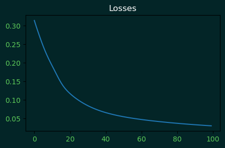

## Artificial Neural Network (ANN) from scrathc.

This is a simple implementation of a neural network from scratch using only numpy.

### How to use it?

```python

from Nn import Layers
from Nn import NInput
from Nn import NLayer

X = np.array([[0,0],[0,1],[1,0],[1,1]])
y = np.array([[0],[1],[1],[0]])

model = Layers()

model.add(NInput(2))
model.add(NLayer(4, activation='tanh'))
model.add(NLayer(4, activation='tanh'))
model.add(NLayer(1, activation='sigmoid'))

model.fit_model(X, y, epochs=10000, learning_rate=0.1)

```

```python
print(model.evaluate_trained_model())

"""
Output:
(1.0, array([[8, 0],
             [0, 4]],dtype=int64))
"""
```

```python
model.show_loss_graph()
```



### Information about the classes

- NInput: This is the input layer, it has no activation function and it's only used to define the input shape of the model.
- NLayer: This is the Multi Layer Perceptron (MLP) layer.
